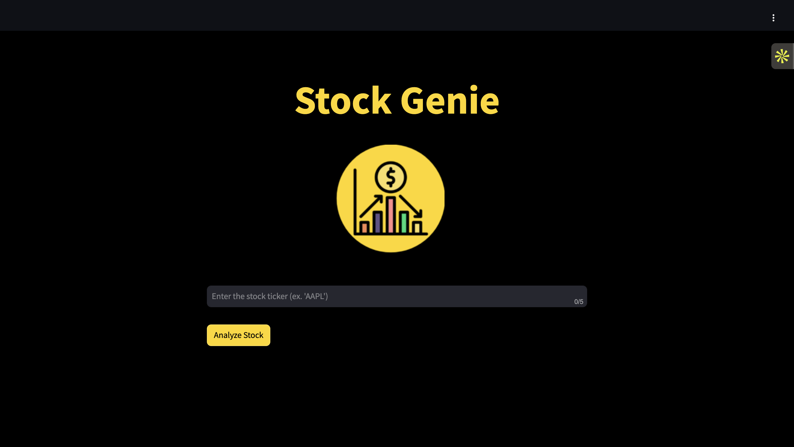

# Stock Genie

Stock Genie is an AI-powered stock analysis Agent that provides comprehensive insights into stocks by analyzing financial data and recent news.



## Features

- **Real-time Stock Data**: Fetches current financial metrics like price, market cap, P/E ratio, and dividend yield
- **Historical Price Charts**: Visualizes stock performance over the past year
- **News Summarization**: Automatically collects and summarizes recent news articles about the company
- **AI Analysis**: Leverages GPT-4o to generate comprehensive investment analyses and recommendations
- **Sleek UI**: Modern black and gold interface with company logos and interactive charts

## How It Works

1. Enter a stock ticker symbol (e.g., "AAPL" for Apple)
2. Click "Analyze Stock" to initiate the analysis
3. Stock Genie will:
   - Fetch current financial data from Yahoo Finance
   - Collect and summarize recent news articles
   - Generate an AI-powered analysis with investment recommendations
   - Display an interactive price chart

## Technical Components

- **Frontend**: Streamlit web application with custom CSS styling
- **Data Sources**: 
  - Yahoo Finance (via yfinance) for financial data
  - Finnhub API for company news
- **AI Models**:
  - Hugging Face's DistilBART for news summarization
  - OpenAI's GPT-4o for comprehensive stock analysis
- **Visualization**: Plotly for interactive stock charts

## Installation

1. Clone the repository:
   ```
   git clone https://github.com/AminAmbike/stock-genie.git
   cd stock-genie
   ```

2. Install dependencies:
   ```
   pip install -r requirements.txt
   ```

3. Set up API keys:
   - Add your OpenAI API key in `LLM.py`
   - Add your Finnhub API key in `summarizer.py`
   - Add your Hugging Face API key in `summarizer.py` (if needed)

4. Run the application:
   ```
   streamlit run app.py
   ```

## File Structure

- **app.py**: Main Streamlit application and UI
- **LLM.py**: Handles stock data retrieval and GPT-4o analysis
- **summarizer.py**: News retrieval and summarization pipeline
- **plot_stock.py**: Stock chart visualization functions
- **icons/**: Contains application icons and images

## Future Enhancements

- Improved UI appearance and customization options
- Better error handling for financial data and news retrieval
- Faster news summarization pipeline
- Addition of "trending stocks" feature
- Outlook forecasting using statistical models
- Enhanced web scraping for more comprehensive news coverage

## Requirements

- Python 3.8+
- Internet connection for API access
- API keys for OpenAI, Finnhub, and Hugging Face (as needed)

## License

This project is available for personal and educational use.

---

Created by Amin Ambike 
